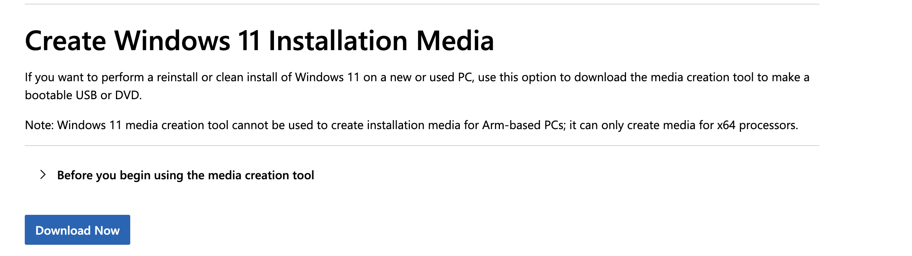

# Windows Installation Utilities

## ChrisTitusTech Windows Utility (winutil)

**URL:** <https://github.com/ChrisTitusTech/winutil>

A comprehensive PowerShell script designed to streamline Windows installation and optimization. This utility provides an easy-to-use interface for debloating Windows, installing essential software, applying system tweaks, and configuring privacy settings. Features include automated software installation, Windows feature management, system optimization presets, and privacy configuration options. Perfect for setting up new Windows installations or optimizing existing systems with minimal effort.

## Windows Unattend Generator

**URL:** <https://schneegans.de/windows/unattend-generator/>

> **⚠️ Quick Setup:** Import the `autounattend.xml` file from this repository into the generator and modify the configuration as needed (especially the username).

An online tool for creating unattended Windows installation files (autounattend.xml). This web-based generator allows you to configure automated Windows installations by creating answer files that can skip manual setup steps during installation. You can customize user accounts, regional settings, partition configurations, and various Windows features. Ideal for system administrators and power users who need to deploy Windows installations with consistent configurations across multiple machines.

## How to Use the Autounattend.xml File

### Step 1: Prepare Windows Installation Media

1. **Download Windows Media Creation Tool** from [Microsoft's official Windows 11 download page](https://www.microsoft.com/en-us/software-download/windows11)

### Step 2: Add the Autounattend.xml File

1. **Copy the `autounattend.xml`** you exported from the site above
2. **Place it in the root directory** of your Windows installation USB drive (same level as setup.exe)
3. **Ensure the filename is exactly** `autounattend.xml` (case-sensitive)

### Step 3: Boot and Install

1. **Boot from the USB drive** on your target computer
2. **Windows will automatically detect** the autounattend.xml file
3. **Installation will proceed automatically** with your pre-configured settings
4. **Monitor the process** - some steps may still require manual intervention depending on your configuration
